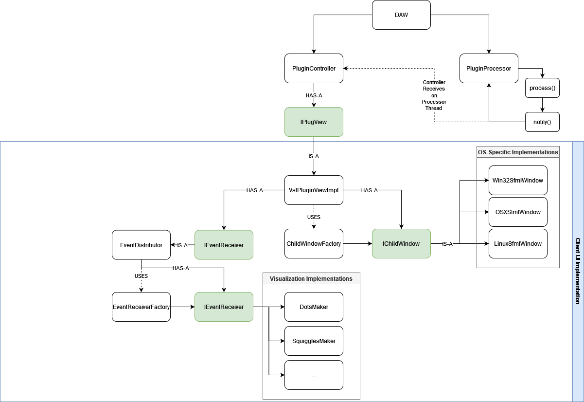

# SFML VST3
VST3 plugin design that uses SFML and ImGui for visualizations. There are several 
visualization engines that can be selected. The visualizations operate on 
midi data received from the VST processor.

## This is just a demo showing how to:
1. integrate SFML + ImGui as a child window
2. use modern VST3 processor and controller paradigm
3. show real-time midi visualizations that are extensible and swappable

---

## dependencies

| #   | Library    | Min Version | Motive              |
|:----|:-----------|:------------|:--------------------|
| 1   | SFML       | 2.5.1       | Graphics/Windows    |
| 2   | ImGui      | 1.85        | Menus               |
| 3   | spdlog     | 1.9.2       | Logging             |
| 4   | imgui-sfml | 2.4         | imgui sfml bindings |
| 5   | VST3 SDK   |             | audio plugin        |

* NOTE: latest imgui-sfml is required in order to allow automatic ImGui context switching, which is REQUIRED for loading multiple instances
---

## architecture

* a crude sketch of the current architecture.

---

## image

